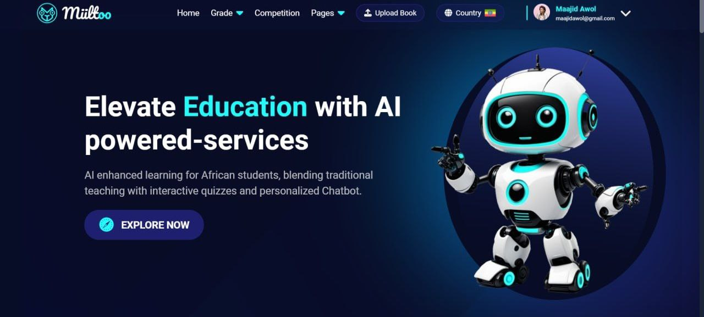

# Project README - Miiltoo: Knowledge Companion

## Project Information

**Project Title:** Miiltoo: Knowledge Companion

### Core Features

1. **AI Chatbot with Curriculum-Based Personality**

   **Description:** This feature introduces a personalized AI chatbot designed specifically for high school students. Each chatbot is customized to the corresponding textbooks in the curriculum, giving these textbooks a unique and engaging personality. High school students can interact with these chatbots as if they were conversing with their curriculum books. This feature aims to make the learning experience more interactive and enjoyable.

2. **Quiz Generation from Customized AI Models**

   **Description:** This feature allows students to access customized AI models for each textbook. Users can select a particular chapter and subtopic from the book and use the AI model to generate quizzes. These quizzes are tailored to the selected content, helping students assess their understanding and knowledge retention. It provides an effective tool for self-assessment and reinforcement of learning. After they finish taking the quiz, students can see their evaluation and answers with explanations for each question.

3. **PDF Upload and Chatbot Interaction**

   **Description:** Feature 3 extends the functionality of the platform to accommodate users beyond high school students. Any user, regardless of their educational background, can upload PDF files. The system then creates a customized AI model based on the content of the uploaded PDF. Users can engage in chatbot conversations using this model and even take quizzes generated from the uploaded content. This feature empowers individuals to interact with and learn from their own data and documents, making the platform versatile and accessible to a broader audience.

## Technology Stack

### Frontend

- Figma (for UI/UX design)
- HTML, CSS, and JavaScript (for development)
- Bootstrap (in some cases for styling)

### Backend

- Flask (for building the backend of web apps)
- SQLAlchemy (for ORM)
- SQLite (database)
- LangChain (for embedding the pretrained model with our data)

### AI Models

- OpenAI’s gpt-3.5-turbo (for chat and quizzing with the data)

### Other Tools

- Git (version control)

## Dependencies 

### Data Sets

**Data Sources:** Ethiopian Ministry of Education High School textbooks (from grade 9-12)

**Data Integration:** We integrated the data into the model using a Python library called LangChain, which allows

 embeddings to pretrained models.

### APIs

**Model Integration:** We integrated OpenAI’s gpt-3 through the LangChain library.

*This README document provides an overview of the Miiltoo project, its objectives, roadmap, features, technology stack, and potential challenges.*
